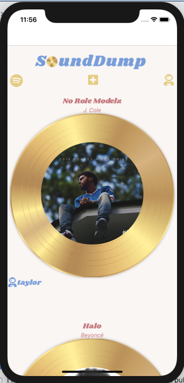

# SoundDump

SoundDump is a mobile application for sharing music that was built using React Native and Django. It allows users to access Spotify via login, search Spotify's database, and generate posts based off of song titles.  SoundDump exists as a social platform for the specific purpose of sharing music.

## Interface

## List of Features

- Users can view the most recent posts from other users on the Home page
- Users can view individual posts by clicking on their titles
- Users can view their own profiles by clicking on the astronaut in the navigation bar
- Users can post new songs via a "new post" page or the Spotify search page
- Users can delete any of their posts
- Users can search Spotify's database to grab a song to post and listen to a preview

## Technologies Used

- Django
    - Utilized Django to handle requests from users, sava data to SoundDump's database, and process the data
- React Native
    - Developed SoundDump via React Native to build a mobile version of SoundDump
- Spotify Web API 
    - Requested data from the Spotify Web API to allow users to search for tracks

## Approach Taken

I initially had the idea of making an Instagram-like song sharing interface, when I found myself asking my friends for song recommendations!  I began by creating posts with embedded links to songs, as well as user-curated titles and captions.  In the process, I realized that many people wouldn't even know where to begin with finding a song to post! So, I figured out how to use the Spotify Web API to retrieve data about songs.  I used specific data from the Spotify Web API, including the song title, artist, a :30 second preview, as well as a link to the song on Spotify to generate a post.

## Unsolved Problems / Future Directions

- I would like to incorporate separate feeds based on a song's "vibe"

